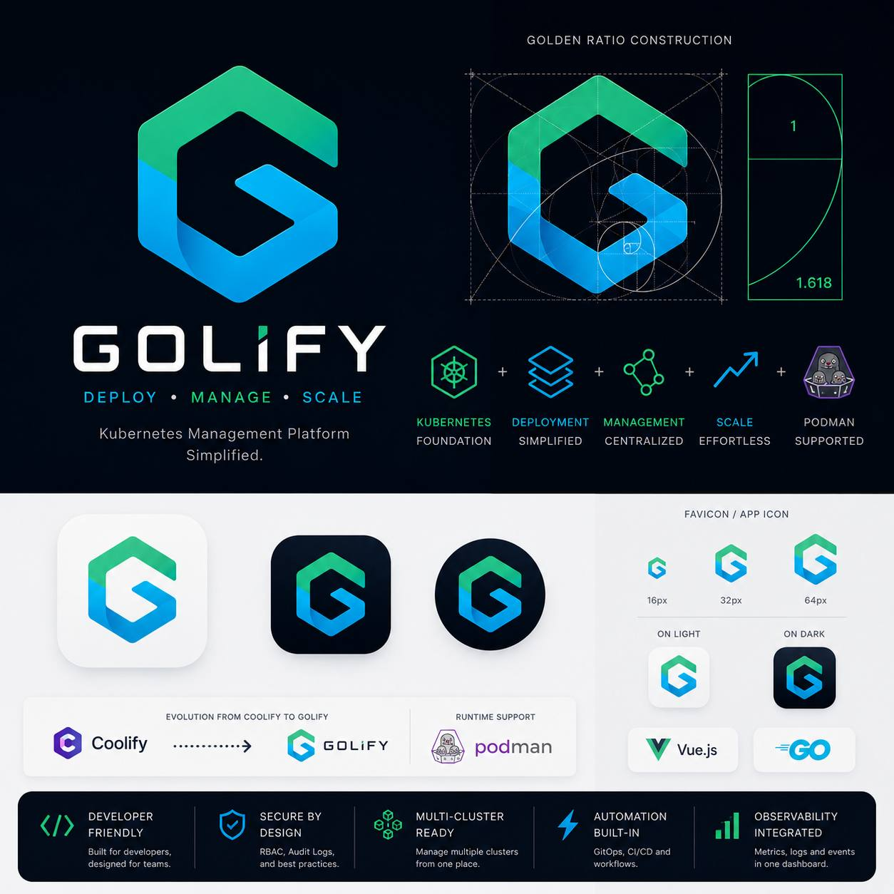

# Golify

**Self-hosted PaaS-style control plane** — manage domains, projects (Kubernetes clusters), servers, sources, S3 storages, keys, API keys, and teams from a single dashboard.

- **Frontend:** Vue 3 SPA (Vite + Tailwind CSS v4 + shadcn-vue + tweakcn)
- **Backend:** Go (Fiber v3) with embedded frontend → single binary
- **Storage:** SQLite (GORM), JWT auth, WebSocket live metrics

---

## ✨ Features

| Area | Description |
|------|-------------|
| **Dashboard** | Live system metrics (CPU per-core chart, memory, disk, network) streamed over WebSocket · gauge cards · container/domain/cluster counts |
| **Domains** | Register and manage root domains (auto-strip scheme, duplicate detection) |
| **Projects** | Project = Kubernetes cluster (kind), created on demand, live status |
| **Servers** | Server inventory with details |
| **Sources** | Connect and manage source repositories |
| **S3 Storages** | Object storage registrations |
| **Keys / API Keys** | Shared variables, secrets, and scoped API keys |
| **Teams** | Team management |
| **Auth** | JWT (7-day expiry), onboarding-first flow, dark mode, remember-login |

---

## 🧱 Stack

### Frontend (`web/`)

Initialized from the official [`create-vue`](https://github.com/vuejs/create-vue) scaffolding — **no AI-generated boilerplate**.

- **Vue 3** + TypeScript + Vue Router + Pinia
- **Tailwind CSS v4** (via `@tailwindcss/vite`) with **tweakcn** design tokens (OKLCH color system)
- **shadcn-vue** (Reka base) component primitives
- **ky** — typed HTTP client (`src/lib/api.ts`)
- **Pinia Colada** — async state (`useQuery` / `useMutation`)
- **Highcharts** — live per-core CPU line chart + reusable gauge component
- **Lucide** icons

### Backend

- **Go** + [Fiber v3](https://gofiber.io/) HTTP framework
- **GORM** + SQLite (WAL mode, foreign keys ON)
- **JWT v5** — HS256, 7-day expiry
- Fiber middleware: `requestid`, `recover`, `etag`, `compress`, `cors`, `limiter`, `logger`
- **WebSocket** — live analytics stream (`/api/ws/analytic`), auth-gated
- `go:embed all:web/dist` — frontend bundled into the Go binary at compile time

---

## 🖼️ Brand & Design



The design system uses a **tweakcn Modern Minimal** theme with an OKLCH color palette:

| Token | Light | Dark |
|-------|-------|------|
| `--background` | `oklch(1 0 0)` (white) | `oklch(0.2046 0 0)` (near-black) |
| `--foreground` | `oklch(0.3211 0 0)` | `oklch(0.9219 0 0)` |
| `--primary` | `oklch(0.6231 0.1880 259.8145)` | same (brand blue) |
| `--border` | `oklch(0.9276 0.0058 264.5313)` | `oklch(0.3715 0 0)` |

- **Typography:** Inter (sans), JetBrains Mono (mono), Source Serif 4 (serif)
- **Radius:** `0.375rem`
- Dark mode toggles via `.dark` class on `<html>`, persisted in localStorage.

---

## 🚀 Getting Started

### Prerequisites

- **Go 1.25+**
- **Node.js 20+** (frontend dev)
- Optional: Docker for containerized builds

### Local development (hot reload)

```bash
# Terminal 1 — frontend (Vite dev server with HMR)
cd web
npm install --legacy-peer-deps
npm run dev

# Terminal 2 — backend (rebuild + run)
go build -o run .
./run
```

### Docker

```bash
docker compose up -d --build
```

---

## 🏗️ Build Pipeline

The frontend is compiled and **embedded into the Go binary** — production runs a single static executable with zero Node runtime:

```
[1] node:22-alpine       npm run build          → web/dist/
[2] golang:1.25-alpine   go:embed web/dist      → single binary
[3] alpine:3.20          copy binary, non-root user
```

---

## 🔌 API

| Method | Path | Auth | Description |
|--------|------|------|-------------|
| GET | `/api/v1/health` | – | Service health `{status, app}` |
| POST | `/api/v1/auth/login` | – | Exchange email/password for JWT |
| POST | `/api/v1/auth/onboard` | – | Create first admin (onboarding) |
| GET | `/api/v1/auth/status` | – | Auth/onboarding status |
| GET | `/api/v1/domains` | JWT | List domains |
| POST | `/api/v1/domains` | JWT | Register domain |
| GET | `/api/v1/projects` | JWT | List projects (with cluster status) |
| POST | `/api/v1/projects` | JWT | Create project + kind cluster |
| GET | `/api/v1/servers` | JWT | List servers |
| GET | `/api/v1/system/containers` | JWT | Container count/runtime |
| WS | `/api/ws/analytic` | JWT (query token) | Live system metrics |

> Full route list evolves as the dashboard grows — browse the Go source for the complete set.

---

## 📁 Project Layout

```
├── main.go            # entrypoint, HTTP listeners, SPA serving
├── api.go             # REST routes
├── models.go          # GORM models
├── domains.go         # domain CRUD
├── projects.go        # project + kind cluster management
├── ws.go              # WebSocket analytics
├── web/               # Vue 3 frontend
│   └── src/
│       ├── views/     # dashboard pages
│       ├── components/ (ui/ = shadcn primitives)
│       ├── stores/    # Pinia stores
│       └── assets/    # styles, brand assets
└── data/
    ├── golify.db      # SQLite
    └── ssl/           # TLS certificates (ACME + custom)
```

---

## 🛡️ Security

- JWT-based authentication with role-gated routes
- Password storage via bcrypt hash (`users.passhash`)
- Onboarding-first flow — no default credentials shipped
- Rate limiting (200 req/min), request IDs, CORS policy
- Non-root container user
- No sensitive values (credentials, tokens, test domains) are committed to this README or the repository

---

## 📝 License

Private — © Sawang Teknologi Indonesia. All rights reserved.
